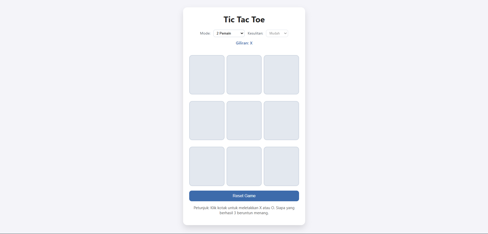
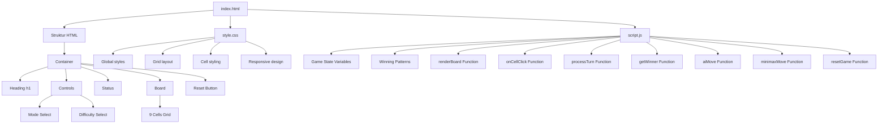
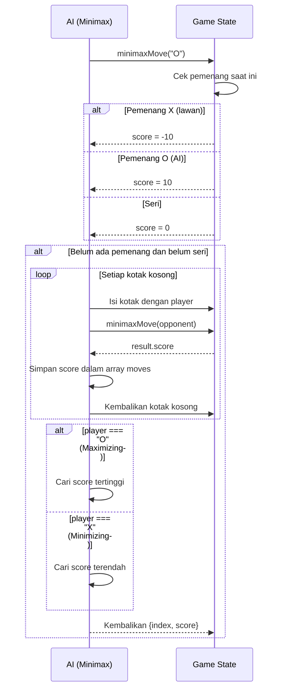

# ⭕ Tic Tac Toe

<div align="center">


**Permainan Tic Tac Toe interaktif dengan mode 2 pemain dan mode AI dengan 3 tingkat kesulitan**

</div>

## 📋 Deskripsi Proyek

**Tic Tac Toe** adalah permainan klasik berbasis web yang memungkinkan pemain untuk bermain melawan teman (2 pemain) atau melawan kecerdasan buatan (AI) dengan tiga tingkat kesulitan. Permainan ini menggunakan algoritma Minimax untuk AI yang dapat bermain secara optimal, serta dilengkapi dengan antarmuka modern dan responsif.

Aplikasi ini sangat berguna untuk mengisi waktu luang, melatih strategi berpikir, atau mempelajari implementasi algoritma AI sederhana dalam permainan. Dengan desain yang bersih dan pilihan mode yang fleksibel, permainan ini cocok dimainkan oleh segala usia.

Fitur utama aplikasi ini:
- **Mode 2 Pemain**: Bermain dengan teman secara bergantian
- **Mode 1 Pemain (AI)**: Bermain melawan komputer dengan 3 tingkat kesulitan
- **AI dengan Minimax**: Algoritma AI yang cerdas untuk tingkat kesulitan "Susah"
- **Tingkat Kesulitan**: Mudah (acak), Sedang (50% acak, 50% optimal), Susah (optimal)
- **Penentuan Pemenang**: Deteksi otomatis pemenang atau seri
- **Reset Game**: Memulai ulang permainan kapan saja

## 📑 Daftar Isi

- [Deskripsi Proyek](#-deskripsi-proyek)
- [Demo](#-demo)
- [Tampilan Aplikasi](#-tampilan-aplikasi)
- [Latar Belakang](#-latar-belakang)
- [Fitur Utama](#-fitur-utama)
- [Teknologi yang Digunakan](#-teknologi-yang-digunakan)
- [Arsitektur](#-arsitektur)
- [Cara Instalasi](#-cara-instalasi)
- [Cara Penggunaan](#-cara-penggunaan)
- [Peran Developer](#-peran-developer)
- [Pembelajaran dari Proyek](#-pembelajaran-dari-proyek-lessons-learned)
- [Ucapan Terima Kasih](#-ucapan-terima-kasih)

## 🎮 Demo

(Coming Soon)

## 📸 Tampilan Aplikasi

### Tampilan Utama




## 🎯 Latar Belakang

Proyek ini dibuat sebagai proyek pribadi untuk mengembangkan keterampilan dalam:

- **Implementasi Algoritma AI**: Menerapkan algoritma Minimax untuk permainan Tic Tac Toe
- **State Management**: Mengelola status permainan, giliran, dan kondisi kemenangan
- **Rekursi dan Backtracking**: Mengimplementasikan pencarian pohon permainan untuk AI optimal
- **Event Handling**: Menangani klik pemain dan giliran bergantian
- **CSS Grid**: Membuat tata letak papan permainan 3x3

Kebutuhan yang melatarbelakangi proyek ini:
- **Keinginan memahami** implementasi AI dalam permainan sederhana
- **Kebutuhan permainan klasik** yang dapat dimainkan dengan teman atau komputer
- **Pembelajaran algoritma** Minimax dan rekursi
- **Pembuatan portofolio** yang menunjukkan kemampuan AI dan game development

## 🌟 Fitur Utama

### 🎮 **Mode Permainan**

| Mode | Deskripsi | Implementasi |
|------|-----------|--------------|
| **2 Pemain** | Dua pemain bergantian meletakkan X dan O | Pemain X dan O dikontrol oleh user |
| **1 Pemain (AI)** | Pemain melawan komputer | AI bermain sebagai O, user sebagai X |

### 🤖 **AI dengan 3 Tingkat Kesulitan**

| Tingkat | Deskripsi | Implementasi |
|---------|-----------|--------------|
| **Mudah** | AI memilih langkah secara acak | `randomChoice()` dari kotak kosong |
| **Sedang** | 50% acak, 50% optimal | Probabilitas 0.5 untuk random, 0.5 untuk Minimax |
| **Susah** | AI bermain optimal | Algoritma Minimax murni |

### 🧠 **Algoritma Minimax**

| Komponen | Deskripsi |
|----------|-----------|
| **Pemain Maximizing** | AI (O) berusaha memaksimalkan skor |
| **Pemain Minimizing** | Lawan (X) berusaha meminimalkan skor |
| **Skor** | Menang = +10, Kalah = -10, Seri = 0 |
| **Rekursi** | Menjelajahi semua kemungkinan langkah |

### ✅ **Deteksi Pemenang**

| Kondisi | Deteksi |
|---------|---------|
| **Menang** | 3 simbol sama dalam baris, kolom, atau diagonal |
| **Seri** | Semua kotak terisi tanpa pemenang |

### 🎨 **Antarmuka**

| Komponen | Deskripsi |
|----------|-----------|
| **Papan 3x3** | Grid dengan efek hover dan animasi |
| **Status Bar** | Menampilkan giliran atau hasil permainan |
| **Mode Selector** | Dropdown untuk memilih mode permainan |
| **Difficulty Selector** | Dropdown untuk tingkat kesulitan (aktif di mode AI) |
| **Reset Button** | Memulai ulang permainan |

## 🛠️ Teknologi yang Digunakan

### Core Technologies

| Teknologi | Fungsi | Alasan Penggunaan |
|-----------|--------|-------------------|
| **HTML5** | Struktur halaman | Standar web, semantik |
| **CSS3** | Styling dan layout | CSS Grid, flexbox, efek hover |
| **JavaScript (ES6+)** | Logika dan interaktivitas | Minimax, state management, DOM manipulation |

### Algoritma yang Digunakan

| Algoritma | Fungsi |
|-----------|--------|
| **Minimax** | AI optimal untuk tingkat kesulitan "Susah" |
| **Rekursi** | Menjelajahi pohon permainan |
| **Random Choice** | AI untuk tingkat kesulitan "Mudah" |
| **Probabilistic** | AI untuk tingkat kesulitan "Sedang" |

## 🏗️ Arsitektur

### Struktur File



### Diagram Alur Aplikasi

```mermaid
graph TD
    A[Halaman Dimuat] --> B[resetGame]
    B --> C[Board kosong]
    B --> D[currentPlayer = X]
    B --> E[playing = true]
    
    F[User klik kotak] --> G[onCellClick]
    G --> H{playing && board kosong && (mode=2p atau giliran X)}
    H -->|Tidak| I[Abort]
    H -->|Ya| J[board[index] = currentPlayer]
    J --> K[renderBoard]
    K --> L[processTurn]
    
    L --> M{getWinner?}
    M -->|Ada pemenang| N[playing = false]
    N --> O[Tampilkan pemenang]
    
    M -->|Tidak ada pemenang| P{Board penuh?}
    P -->|Ya| Q[playing = false]
    Q --> R[Tampilkan Seri]
    
    P -->|Tidak| S[currentPlayer = ganti giliran]
    S --> T[Update status]
    
    T --> U{mode === 1p && playing && currentPlayer === O}
    U -->|Ya| V[aiMove]
    U -->|Tidak| W[Selesai]
    
    V --> X{getAIMove}
    X --> Y[Difficulty = easy: randomChoice]
    X --> Z[Difficulty = medium: 50% random, 50% minimax]
    X --> AA[Difficulty = hard: minimaxMove]
    
    Y --> AB[board[index] = O]
    Z --> AB
    AA --> AB
    AB --> K
```

### Diagram Alur Minimax



### Penjelasan File

| File | Fungsi |
|------|--------|
| **index.html** | Struktur dasar permainan. Berisi container, mode selector, difficulty selector, status bar, papan permainan, dan tombol reset. |
| **style.css** | Styling permainan. Mengatur tata letak grid 3x3, efek hover pada sel, dan tampilan responsif. |
| **script.js** | Logika permainan. Mengelola state permainan, deteksi pemenang, implementasi AI dengan Minimax, dan event handling. |

## 📥 Cara Instalasi

### Prasyarat

- **Browser modern** (Chrome, Firefox, Edge, Safari)

### Langkah-langkah Instalasi

1. **Clone Repository**
   ```bash
   git clone https://github.com/Chrisimana/tic-tac-toe-game.git
   cd tic-tac-toe
   ```

2. **Buka File HTML**
   - **Cara 1**: Double-click file `index.html`
   - **Cara 2**: Buka dengan browser: `open index.html` (Mac) atau `start index.html` (Windows)

3. **Selesai!** Permainan Tic Tac Toe siap dimainkan.

### Alternatif: Live Server (Development)

Jika menggunakan VS Code, install extension Live Server lalu klik kanan pada `index.html` → "Open with Live Server".

## 🎮 Cara Penggunaan

### Menjalankan Aplikasi

Buka file `index.html` di browser web modern.

### Panduan Penggunaan Lengkap

#### 1. **Memilih Mode Permainan**

1. Pada dropdown **"Mode"**, pilih:
   - **2 Pemain**: Bermain dengan teman (X dan O dikontrol oleh pemain)
   - **1 Pemain (AI)**: Bermain melawan komputer

2. Jika memilih mode AI, dropdown **"Kesulitan"** akan aktif:
   - **Mudah**: AI memilih langkah secara acak
   - **Sedang**: AI 50% acak, 50% optimal
   - **Susah**: AI bermain optimal dengan algoritma Minimax

#### 2. **Aturan Permainan**

- Pemain X selalu berjalan pertama
- Pemain bergantian meletakkan simbol di kotak kosong
- Pemenang adalah pemain yang berhasil membuat 3 simbol berurutan:
  - Secara horizontal (baris)
  - Secara vertikal (kolom)
  - Secara diagonal
- Jika semua kotak terisi tanpa pemenang, permainan berakhir seri

#### 3. **Cara Bermain Mode 2 Pemain**

1. Pemain X memulai dengan mengklik kotak kosong
2. Status akan menampilkan "Giliran: O"
3. Pemain O mengklik kotak kosong
4. Bergantian hingga ada pemenang atau seri

#### 4. **Cara Bermain Mode 1 Pemain (AI)**

1. Pemain (X) memulai dengan mengklik kotak kosong
2. AI (O) akan merespons setelah jeda singkat
3. Bergantian hingga ada pemenang atau seri

#### 5. **Memulai Ulang Permainan**

Klik tombol **"Reset Game"** untuk:
- Mengosongkan papan
- Mereset giliran ke X
- Memulai permainan baru dengan mode dan difficulty yang sama

### Contoh Skenario

| Skenario | Deskripsi |
|----------|-----------|
| **Menang Horizontal** | X di (0,1,2) - baris pertama |
| **Menang Vertikal** | O di (0,3,6) - kolom pertama |
| **Menang Diagonal** | X di (0,4,8) - diagonal utama |
| **Seri** | Semua kotak terisi, tidak ada 3 berurutan |

### Tips Bermain

1. **Mode Mudah**: Manfaatkan kesalahan AI yang acak
2. **Mode Susah**: Gunakan strategi untuk memblokir langkah AI
3. **Kuasai kotak tengah**: Kotak tengah (indeks 4) adalah posisi strategis
4. **Ciptakan ancaman ganda**: Buat situasi di mana Anda memiliki 2 cara menang sekaligus

## 👨‍💻 Peran Developer

Sebagai developer proyek pribadi ini, saya bertanggung jawab atas:

### Peran dalam Proyek

| Area | Kontribusi |
|------|------------|
| **Perencanaan** | Merancang mekanisme permainan dan AI |
| **AI Development** | Mengimplementasikan algoritma Minimax dengan rekursi |
| **Game Logic** | Mengelola state permainan, giliran, dan deteksi pemenang |
| **UI/UX Design** | Mendesain antarmuka modern dengan CSS Grid |
| **Frontend Development** | Membangun struktur HTML dan styling CSS |
| **Event Handling** | Menangani klik pemain dan AI response |

### Fokus Pengembangan

1. **Algoritma AI**
   - Implementasi Minimax dengan rekursi dan backtracking
   - Tingkat kesulitan dengan probabilitas
   - Evaluasi skor untuk menentukan langkah terbaik

2. **Game Logic**
   - Deteksi pemenang dengan pola kemenangan
   - Validasi langkah yang valid
   - Manajemen giliran pemain

3. **User Experience**
   - Feedback visual yang jelas
   - Status permainan yang informatif
   - Kemudahan reset permainan

## 📚 Pembelajaran dari Proyek (Lessons Learned)

### Keterampilan Teknis yang Diperoleh

#### 1. **Implementasi Minimax Algorithm**
```javascript
function minimaxMove(player) {
  const opponent = player === "O" ? "X" : "O";
  const winner = getWinner(board);
  if (winner === "X") return { score: -10 };
  if (winner === "O") return { score: 10 };
  if (!board.includes(null)) return { score: 0 };

  const moves = [];

  for (let i = 0; i < board.length; i++) {
    if (board[i] === null) {
      board[i] = player;
      const result = minimaxMove(opponent);
      moves.push({ index: i, score: result.score });
      board[i] = null;
    }
  }

  if (player === "O") {
    // Maximizing player
    let bestScore = -Infinity;
    for (const move of moves) {
      if (move.score > bestScore) {
        bestScore = move.score;
        bestMove = move;
      }
    }
  } else {
    // Minimizing player
    let bestScore = Infinity;
    for (const move of moves) {
      if (move.score < bestScore) {
        bestScore = move.score;
        bestMove = move;
      }
    }
  }

  return bestMove || { index: null, score: 0 };
}
```

#### 2. **Deteksi Pemenang dengan Pola**
```javascript
const winningPatterns = [
  [0, 1, 2], [3, 4, 5], [6, 7, 8], // Baris
  [0, 3, 6], [1, 4, 7], [2, 5, 8], // Kolom
  [0, 4, 8], [2, 4, 6]             // Diagonal
];

function getWinner(boardState = board) {
  for (const pattern of winningPatterns) {
    const [a, b, c] = pattern;
    if (boardState[a] && boardState[a] === boardState[b] && boardState[b] === boardState[c]) {
      return boardState[a];
    }
  }
  return null;
}
```

#### 3. **AI dengan Tingkat Kesulitan**
```javascript
function getAIMove() {
  const emptyCells = board.map((v, i) => (v === null ? i : null)).filter((v) => v !== null);
  if (emptyCells.length === 0) return null;

  const level = difficulty;
  if (level === "easy") {
    return randomChoice(emptyCells);
  }

  if (level === "medium") {
    if (Math.random() < 0.5) {
      return randomChoice(emptyCells);
    }
    return minimaxMove("O").index;
  }

  // hard
  return minimaxMove("O").index;
}
```

#### 4. **CSS Grid untuk Papan 3x3**
```css
.board {
  display: grid;
  grid-template-columns: repeat(3, 1fr);
  gap: 8px;
}

.cell {
  width: 100%;
  padding-top: 100%;
  position: relative;
}
```

#### 5. **State Management Permainan**
```javascript
let board = Array(9).fill(null);
let currentPlayer = "X";
let playing = true;
let mode = "2p";
let difficulty = "easy";

function processTurn() {
  const winner = getWinner();
  if (winner) {
    playing = false;
    updateStatus(`Pemenang: ${winner}`);
    return true;
  }

  if (!board.includes(null)) {
    playing = false;
    updateStatus("Hasil: Seri");
    return true;
  }

  currentPlayer = currentPlayer === "X" ? "O" : "X";
  updateStatus(`Giliran: ${currentPlayer}`);
  return false;
}
```

### Soft Skills yang Dikembangkan

#### 1. **Algoritma AI**
- Memahami konsep pohon permainan (game tree)
- Menerapkan rekursi untuk pencarian solusi
- Menyeimbangkan antara optimalitas dan performa

#### 2. **Game Theory**
- Memahami konsep maximizing dan minimizing player
- Evaluasi skor untuk menentukan langkah terbaik
- Backtracking untuk mengeksplorasi semua kemungkinan

#### 3. **User Experience**
- Memberikan pilihan tingkat kesulitan
- Status permainan yang jelas
- Kemudahan reset tanpa reload halaman

## 🙏 Ucapan Terima Kasih

### Sumber Daya dan Referensi

#### Dokumentasi Resmi
- [MDN Web Docs](https://developer.mozilla.org/) - Dokumentasi HTML, CSS, JavaScript
- [Minimax Algorithm](https://en.wikipedia.org/wiki/Minimax) - Referensi algoritma Minimax

#### Tools yang Membantu
- **GitHub** - Hosting repository dan version control
- **VS Code** - Editor kode
- **Shields.io** - Badges untuk README
- **Mermaid.js** - Diagram alur

---

<div align="center">

**⭐ Jika proyek ini membantu Anda memahami AI dan permainan klasik, berikan bintang! ⭐**

**"Strategi yang baik adalah kemenangan yang direncanakan. Latih otak Anda dengan Tic Tac Toe!"**

</div>